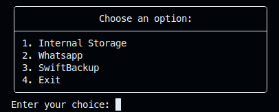

# Android Backup Tool
This collection of scripts allows you to incrementally back up the internal storage of your Android phone to your PC. All of this is made possible by the [MagiskSSH](https://gitlab.com/d4rcm4rc/MagiskSSH_releases) module created by D4rCM4rC. Please note that root access is required for using this tool. 

<div style="text-align:center">
    
</div>

## 🔒Prerequisites

Before using this script, ensure that you have met the following prerequisites:

- Install **adb** and add it to your system's PATH.
- Install **MagiskSSH** to enable SSH.
- Make sure USB debugging is enabled on your device.

## 🔧Setup

The first time you use the script you need to follow the steps below:

1. Connect your Android device to your PC using a USB cable.
2. Generate an [SSH Key Pair](https://docs.oracle.com/en/cloud/cloud-at-customer/occ-get-started/generate-ssh-key-pair.html).
3. Run the following command on your PC:
```bash
./setup_ssh.sh "public_key" (with trailing commas)
```
4. Replace 'public_key' with your own public key. This public key will be added to the authorized keys on your Android device, allowing you to connect via SSH.

Make sure to grant any necessary permissions or prompts that appear on your Android device. Then follow the instructions.

You will be prompted to choose whether you want to preserve the public key if the module is uninstalled. If you choose to preserve the public key, it will be kept even if you uninstall the MagiskSSH module.
If you choose not to preserve the public key, it will be removed when uninstalling the module.

One last thing you need to do is create your own `.env` file. You can take `.env_example` and rename it.

## 📱Usage

Once you have completed the setup process, you can finally execute on your PC:
```bash
./abt.sh <android_ip>
```
Every time you run the script, you need to first enable [Wireless Debugging](https://developer.android.com/static/studio/images/run/adb_wifi-wireless_debugging.png) on your phone. If you have [nmap](https://nmap.org/) installed on your PC, the script will automatically scan for the Wireless Debugging port. If not, you will be prompted to enter it manually.

The SSH service will be started, and you will be presented with the main menu. Regardless of the folder you choose, rsync will always perform a dry-run pass to show which files will be copied/deleted. After you finish, don't forget to exit the script using option 4, which also stops the SSH service.

💡Hint: You can use the [Quick settings developer tiles](https://developer.android.com/static/studio/images/run/adb_wifi-quick_settings.png) for Wireless debugging, located in Developer Options > Quick settings developer tiles. This allows you to quickly turn it on and off.

## Motivation

The goal is to create a tool that requires minimal software involvement and offers a wireless backup option, reducing reliance on unreliable MTP (Media Transfer Protocol).

With this tool, users can easily back up their Android phone to their PC. It eliminates the need for a physical USB connection and utilizes the secure SSH connectivity provided by the MagiskSSH module. The rsync's incremental backup feature saves time and storage by copying only newly added or modified files.

In summary, this Android Backup Tool offers a user-friendly and reliable solution for users who want a hassle-free backup option in case of a lost or stolen phone.